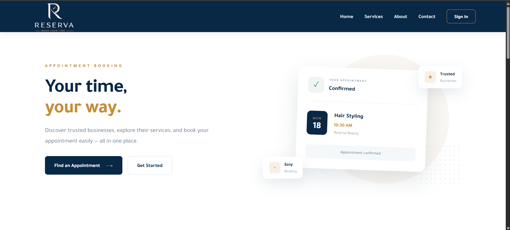
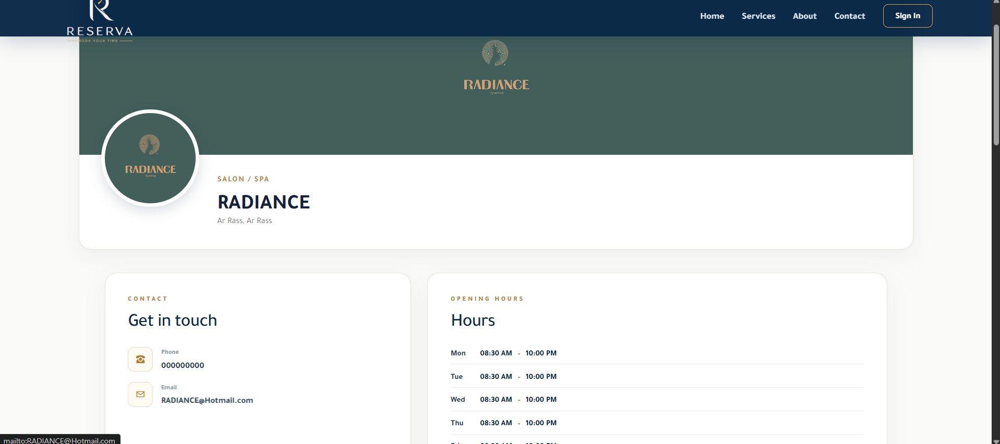
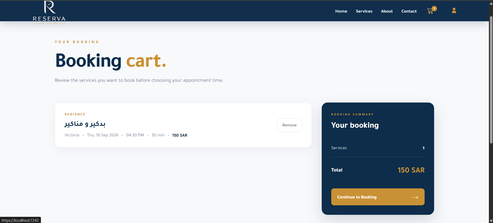
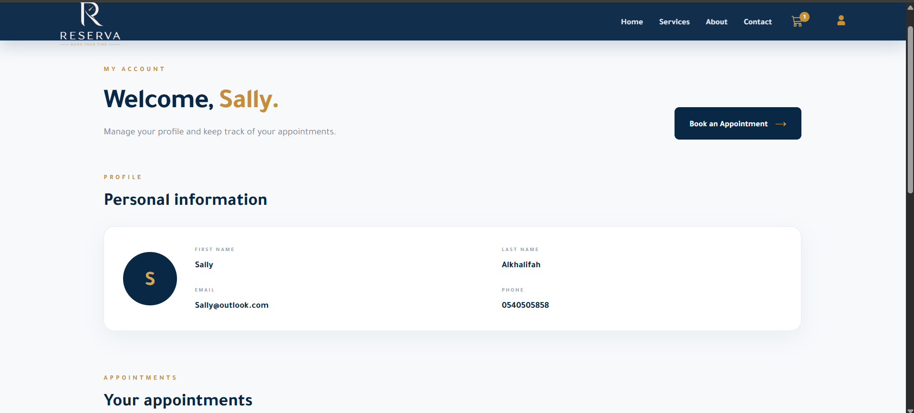
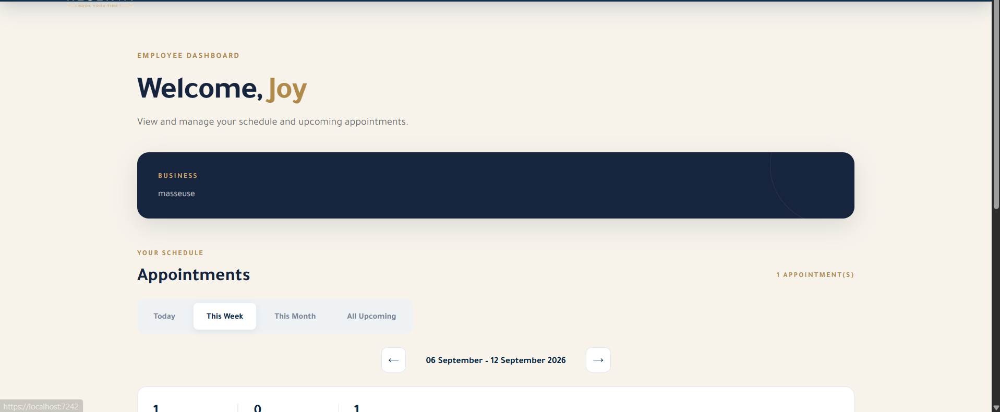
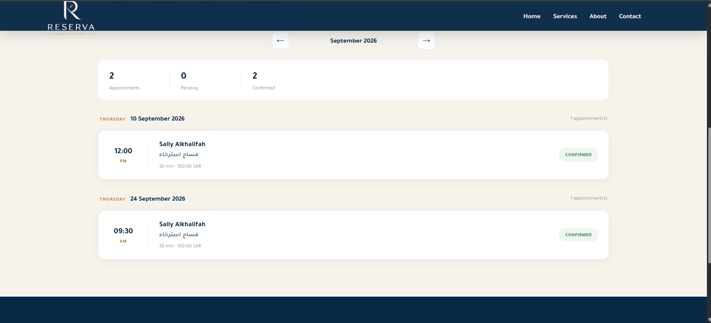
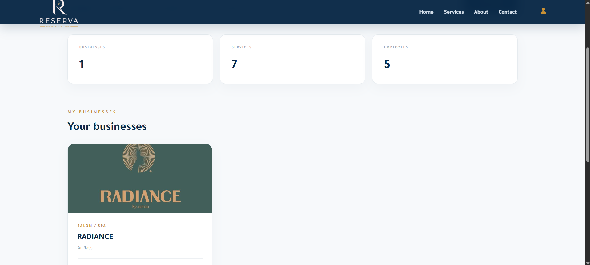
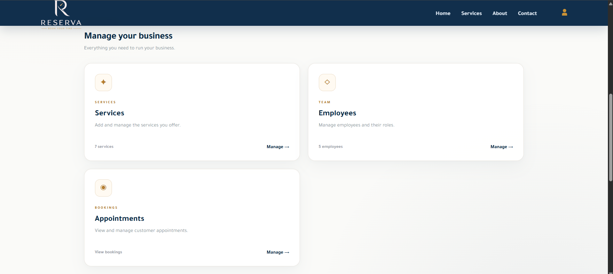

© 2026 Sally Al-Khalifah. All Rights Reserved.
This project is provided for portfolio and educational viewing purposes. Unauthorized copying, modification, redistribution, or commercial use is not permitted.

# Reserva — Appointment Booking Platform

Reserva is a full-stack appointment booking platform built with **Blazor and .NET 10**.

The platform connects customers with businesses and their employees, allowing customers to discover services, choose an employee, view available appointment times, and book services. Business owners can manage their businesses, services, employees, working hours, and appointments.

---

##  Features

###  Customer

- Browse businesses and available services
- View business profiles and details
- Select a preferred employee
- View available appointment dates and time slots
- Add bookings to a cart
- Confirm appointments
- View upcoming and past appointments
- Cancel reservations
- Multilingual-ready interface

###  Business Owner

- Create and manage businesses
- Upload business logos and banners
- Manage business information
- Add and manage services
- Set service prices and durations
- Create and manage employee accounts
- Assign services to employees
- Configure employee working hours
- Manage business working hours
- Manage customer appointments
- Confirm or cancel appointments
- View appointment details

###  Employee

- Dedicated employee account
- Employee dashboard
- View assigned appointments
- View customer and service information
- View daily, weekly, and monthly schedules
- Manage appointment status

###  Booking System

- Employee-specific availability
- Service duration-based time slots
- Working-hour validation
- Prevents conflicting appointments
- Prevents booking past time slots
- Re-checks availability when confirming a booking
- Supports multiple services in a booking cart

---

##  Technologies

- **C#**
- **.NET 10**
- **Blazor Interactive Server**
- **Entity Framework Core**
- **SQL Server / LocalDB**
- **HTML5**
- **CSS3**
- **JavaScript**
- **Bootstrap**
- **Git & GitHub**

---

##  Architecture

Reserva follows a layered architecture with separation of responsibilities:

```text
Reserva
│
├── Reserva
│   └── Presentation / Blazor UI
│
├── Reserva.Application
│   ├── DTOs
│   ├── Interfaces
│   ├── Services
│   ├── Repositories
│   └── Features
│
├── Reserva.Domain
│   ├── Entities
│   └── Enums
│
└── Reserva.Infrastructure
    ├── Data
    ├── Repositories
    └── Migrations
```
## Layers

### Presentation

Blazor components
Pages
Layouts
UI styling
Client-side JavaScript

### Application

Business logic
DTOs
Service interfaces
Repository interfaces

### Domain

Core entities
Relationships
Enums

### Infrastructure

Entity Framework Core
SQL Server
Database context
Repository implementations
Database migrations

## Main Entities
```text
User
 │
 ├── Customer
 ├── Business Owner
 └── Employee
       │
       ├── Services
       ├── Working Hours
       └── Appointments

Business
 │
 ├── Services
 ├── Employees
 ├── Working Hours
 └── Appointments

Service
 │
 ├── Price
 ├── Duration
 └── Employees

Appointment
 │
 ├── Customer
 ├── Employee
 ├── Service
 └── Business
```
 ## User Roles

Reserva supports three main user roles:

Role	Main Responsibilities
Customer	Browse services and make appointments
Business Owner	Manage businesses, employees, services, and appointments
Employee	View and manage assigned appointments
## 📸 Screenshots

### Home Page



### Business Profile



### Booking



### Customer Dashboard



### Employee Dashboard





### Business Management





Add screenshot here
